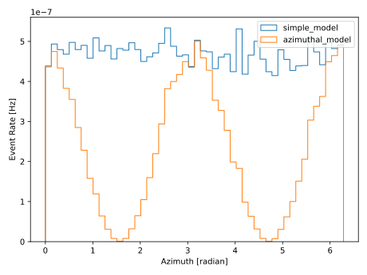

.. SPDX-FileCopyrightText: © 2022 the SimWeights contributors
..
.. SPDX-License-Identifier: BSD-2-Clause

Adding Additional Parameters to Fluxes
======================================

By default simweights makes PDGID, energy, and zenith available to flux models
passed to :py:func:`simweights.Weighter.get_weights`. Normally that is all you need for most models.
But if you have a more complex model that depends on additional parameters you
can add them with :py:func:`simweights.Weighter.add_weight_column`.

In the example below, azimuth angle from ``PolyplopiaPrimary`` is added to
so that a model with azimuth angle can be applied. In this case the data was
taken from the same data table but in principle it could be from any source
as long as it is a numpy array of the correct shape.

.. literalinclude:: ../examples/additional_flux_params.py
    :start-after: start-box1
    :end-before: end-box1

