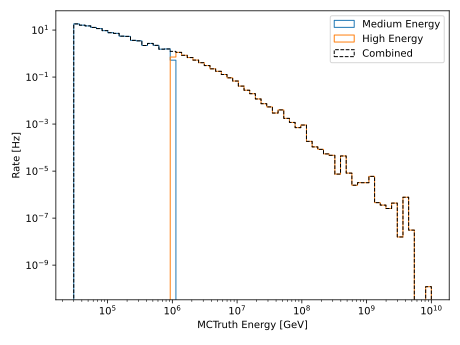
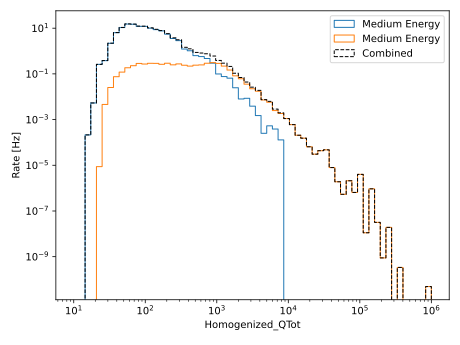

.. SPDX-FileCopyrightText: © 2022 the SimWeights contributors
..
.. SPDX-License-Identifier: BSD-2-Clause

How to Combine Datasets
=======================

The syntax for combining multiple datasets is quite simple. Use the addition
operator to combine two or more weighter object. The resulting object will
correctly weight the combined sample.

.. literalinclude:: ../examples/combined_plot.py
    :start-after: start-box1
    :end-before: end-box1

To obtain values from reconstructions with combined datasets the ``get_column()`` function is quite
useful. It will get the corresponding column from each hdf5 file and append them into a single
numpy array.

.. literalinclude:: ../examples/combined_plot.py
    :start-after: start-box2
    :end-before: end-box2

