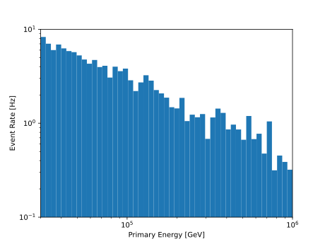

.. SPDX-FileCopyrightText: © 2022 the SimWeights contributors
..
.. SPDX-License-Identifier: BSD-2-Clause

Triggered CORSIKA Tutorial
==========================

The easiest way to use simweights is to book your data to hdf5files using tableio.

.. literalinclude:: ../examples/triggered_corsika_book.py

Note that two of the booked keys are :code:`I3PrimaryInjectorInfo` and :code:`I3CorsikaWeight`,
these are the keys which contain the information necessary to calculate the weights.

You can check that the hdf5 file was created correctly by running ``h5ls``.
The output should look something like this:

.. code-block :: shell-session

    $ h5ls Level2_IC86.2016_corsika.021682.hdf5
    I3CorsikaWeight          Dataset {6948/Inf}
    I3PrimaryInjectorInfo    Dataset {40/Inf}
    PolyplopiaPrimary        Dataset {6948/Inf}
    __I3Index__              Group

Now we can run a our script which calculates the weights and make a histogram.

.. literalinclude:: ../examples/triggered_corsika_plot.py

The output should look something like this:

