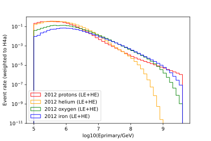

.. SPDX-FileCopyrightText: © 2022 the SimWeights contributors
..
.. SPDX-License-Identifier: BSD-2-Clause

IceTop CORSIKA Tutorial
===========================

IceTop simulations are typically performed by throwing CORSIKA showers uniformly within a circular area
defined by a radius (the "sampling radius"), using the "topsimulator" project.  Although the
high-energy muons in the showers can also be propagated to the deep in-ice detector, it is the
sampling radius at the surface that is important for weighting.  Each CORSIKA shower is also typically
thrown ("resampled") onto the IceTop array some number of times (usually 100) to ensure that some will
trigger the detector.
So, IceTop simulations have their own class of S-frame object: the I3TopInjectorInfo, which records:

* The number of events generated
* The primary nuclear type
* The sampling radius
* The min and max zenith angle
* The min and max primary energy
* The power law index

As with the other kinds of weighters,
the easiest way to use simweights is to book your data to hdf5files using tableio, if this has not
already been done for you:

.. literalinclude:: ../examples/icetop_book.py

Note that one of the booked keys is ``I3TopInjectorInfo``,
which lives in the S-frame and contains the information necessary to calculate the weights.
You should see I3TopInjectorInfo listed as a ``Dataset`` if you inspect your output file using the
:command:`h5ls` command.

Once you've got hdf5 files booked, the simweights project can be used to calculate the weights for an
analysis.
Cosmic ray analyses typically deal with large numbers of events, stored in not just one file but
collections of files which must be combined together.
Here is an example:

.. literalinclude:: ../examples/icetop_plot.py

Note that many of the cosmic ray flux models in simweights, such as ``Hoerendel``, ``GaisserH3a``,
``GaisserH4a``, ``GlobalFitGST``, etc., are five-component (p, He, N, Al, Fe) models.
Many IceTop simulations however use four components (p, He, O, Fe).  So not all of these models are
usable out of the box with four-component IceTop simulations... two of them (``Hoerandel_IT``, and
``GaisserH4a_IT``) have been coded up as four-component versions.

To weight to a fixed spectral index rather than a model, use something like this:

.. code-block :: python

    powerlawindex = -2.7
    weights = weighter.get_weights(lambda energy: energy**powerlawindex)

For the ``GaisserH4a_IT`` model, the output should look something like this.  This plot was made by
combining low- and high-energy samples from each nuclear type (for instance, dataset 12360 + 20143 for the
protons), so that it spans the full energy range from 10^5 -> 10^9.6 GeV.

