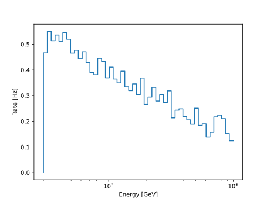
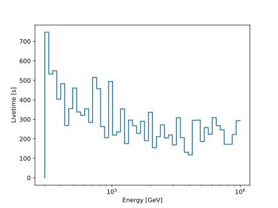

.. SPDX-FileCopyrightText: © 2022 the SimWeights contributors
..
.. SPDX-License-Identifier: BSD-2-Clause

How to Calculate Effective Livetime
===================================

The effective livetime of a simulation sample is calculated by dividing the sum of the weights squared by
the sum of the weights.

.. math::

    L_{eff} = \frac{\sum{w_i}}{\sum{w_i^2}}

As shown in the example below it can be calculated for any sample or for any subsample by using histograms.

.. literalinclude:: ../examples/livetime.py

