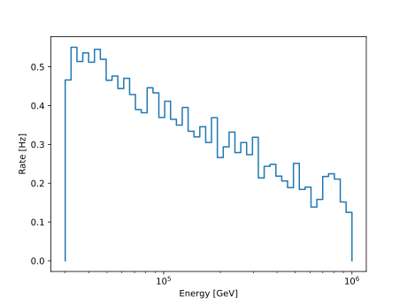
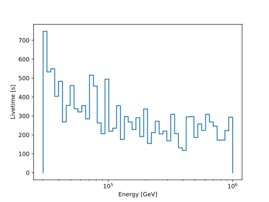

.. SPDX-FileCopyrightText: © 2022 the SimWeights contributors
..
.. SPDX-License-Identifier: BSD-2-Clause

How to Calculate Effective Livetime
===================================

The effective livetime of a simulation sample is calculated by dividing the sum of the weights squared by
the sum of the weights.

.. math::

    L_{eff} = \frac{\sum{w_i}}{\sum{w_i^2}}

The effective livetime is defined as the time the detector would need to take data to have a sample
with the same average, relative uncertainty as the MC set [#]_.
The uncertainty of an unweighted sample with :math:`N=RL` events is :math:`\sqrt{N}`,
which assumes a Poisson distribution
of the event number. :math:`R` is the event rate and :math:`L` the livetime.
The uncertainty of the event rate :math:`R=\sum_i w_i` from a weighted MC set is
:math:`\Delta R = \sqrt{\sum_i w_i^2}` [#]_.
Thus we can easily derive the above definition from

.. math::
    \frac{\sqrt{N}}{N} = \frac{\sqrt{RL}}{RL} \overset{!}{=} \frac{\Delta R}{R}

Rearranging the last equality results in the above expression for the effective livetime.

As shown in the example below it can be calculated for any sample or for any subsample by using histograms.

.. literalinclude:: ../examples/livetime.py

.. [#] See `this <https://internal-apps.icecube.wisc.edu/reports/data/icecube/2009/02/001/icecube_200902001_v2.pdf>`_ report by Michelangelo D’Agostino (requires password access).
.. [#] This can be derived from the fundamental properties of the variance: :math:`\sigma^2(cx)=c^2\sigma^2(x)` and :math:`\sigma^2(x_1+x_2)=\sigma^2(x_1)+\sigma^2(x_2)`, see e.g. `here <https://www.boost.org/doc/libs/1_83_0/libs/histogram/doc/html/histogram/rationale.html#histogram.rationale.weights>`_.
