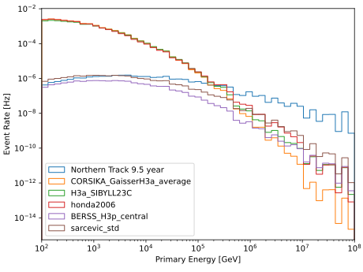

.. SPDX-FileCopyrightText: © 2022 the SimWeights contributors
..
.. SPDX-License-Identifier: BSD-2-Clause

How to Use NuFlux Models
========================

SimWeights makes weighting with `nuflux <https://github.com/icecube/nuflux>`_ very easy.
All you have to do is pass a nuflux model to :code:`get_weights()` just like a callable.
SimWeights will detect that it is a nuflux model and do the correct thing.

This example creates a number of nuflux models and compares them with a custom
flux model from the IceCube northern track result.

.. literalinclude:: ../examples/nugen_nuflux.py
     :start-after: start-box1
     :end-before: end-box1

