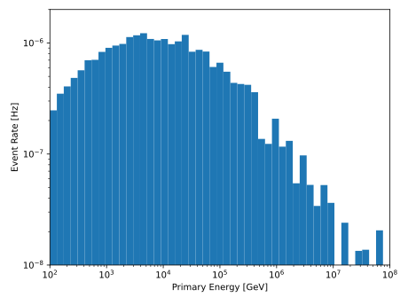

.. SPDX-FileCopyrightText: © 2022 the SimWeights contributors
..
.. SPDX-License-Identifier: BSD-2-Clause

Neutrino Generator Tutorial
===========================

The easiest way to use simweights is to book your data to hdf5files using tableio.

.. literalinclude:: ../examples/nugen_book.py

Note that one of the booked keys is ``I3MCWeightDict``,
the key which contains the information necessary to calculate the weights.

You can check that the hdf5 file was created correctly by running ``h5ls``.
The output should look something like this:

.. code-block :: shell-session

    $ h5ls Level2_IC86.2016_NuMu.021217.hdf5
    I3MCWeightDict           Dataset {7485/Inf}
    PolyplopiaPrimary        Dataset {7485/Inf}
    __I3Index__              Group

Now we can run a our script which calculates the weights and make a histogram.

.. literalinclude:: ../examples/nugen_plot.py

Note that we need to pass the number of files to :code:`NuGenWeighter` and
that the model is a function that returns a value in units of
:math:`\mathrm{GeV}^{-1}\cdot\mathrm{cm}^{-2}\cdot\mathrm{sr}^{-1}\cdot{s}^{-1}`
per neutrino flavor.

The output should look something like this:

