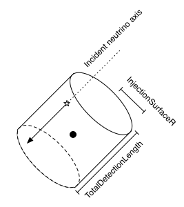
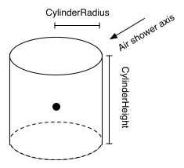

.. SPDX-FileCopyrightText: © 2022 the SimWeights contributors
..
.. SPDX-License-Identifier: BSD-2-Clause

Spatial Distributions
=====================

This page describes the different zenith distributions used in IceCube
simulation and the reason they were selected.

An event generator typically needs to sample 6 variables to start an event,
energy, zenith, azimuth, x, y, and z. Energy is often decoupled from the other variables.
The remaining five variables must be sampled to maximize particles which interact with the
detector to avoid waisted computing resources. The volume on which the vertex is sampled
should be just small enough to encompasses all particle which interact with the detector
but no bigger.

CircleInjector
--------------

The simplest way to sample is picking a direction by sampling on of a sphere
and then sampling the vertex on a cylinder coaxial with the direction.
The primary advantage of this is that the generation surface is very simple to calculate: the generation
surface is the solid angle of the sphere times the area of the cap of the cylinder,
which will not change from event to event. This is the method used by genie-reader as well as for older
neutrino generator datasets. Genie-reader uses a constant length cylinder while neutrino-generator
uses a length from a function of primary energy that estimates the upper limit of muon range.
SimWeights uses :py:class:`simweights.CircleInjector` to weight datasets that use this method.

The sampling surface is a disc perpendicular to the neutrino direction
and centered on the origin of the coordinate system; the neutrino axes are distributed uniformly over this
area.

A uniform sampling on the area of a sphere is accomplished by sampling uniform in both azimuth and
cos(zenith), so sometimes this is referred to as uniform cos(zenith) sampling.

    Simple generation surface used by genie-reader and older neutrino generator datasets,
    the etendue of the generation surface is the same for all events, which simplifies
    calculating weights.

UniformSolidAngleCylinder
-------------------------

Although the method described above makes weighting simple, Unfortunately, it has drawbacks:
the simulated volumen is larger than it needs to be because the cylinder radius often needs to be
significantly larger than the physical size of the detector.
In addition, it was found for some studies a uniform cosine zenith distribution
produced insufficient statistics close to the poles.
Because of this neutrino-generator switched to using an upright cylinder for the vertex position with a
custom `Zenith Distribution`_. NuGen stores the weight from this custom zenith distribution in
``I3MCWeightDict`` as ``ZenithWeight`` and this is one of the factors that is included in ``TotalWeight``.
Since, simweights applies the value of ``TotalWeight`` to every event, there is no need for
simweights explicitly add this factor to the weight.
simweights then uses :py:class:`simweights.UniformSolidAngleCylinder` to handle the normalization
event though the actual zenith distribution is non-uniform.

.. _Zenith Distribution: https://docs.icecube.aq/icetray/main/projects/neutrino-generator/weighting.html#zenith-weight

NaturalRateCylinder
-------------------

Due to the necessity to produce high CORSIKA statistics corsika-reader needs to use
the most efficient method of generating primaries. This means generating events on the
smallest surface that encompasses all events which would trigger the detector.
A cylinder with a vertical axis is sufficient for the geometry of IceCube's.
If an isotropic flux of particles were incident on a cylinder then the rate that they
would intersect the surface of a cylinder is proportional to the cross section of that
cylinder perpendicular to the direction of motion.

    The target surface for dCORSIKA simulation is an upright cylinder centered on the origin of the IceCube
    coordinate system, and typically extending several hundred meters beyond the edge of the instrumented
    volume.

The formula for the cross-sectional area of a cylinder is:

.. math::

    A(\theta) = \pi\cdot r^2\cdot\lvert\cos(\theta)\rvert + 2\cdot r\cdot l \cdot\sqrt{(1-\cos^2(\theta))}

Accounting for the solid angle factor of :math:`cos(\theta)` the intensity one needs to sample from to get
the an isotropic flux is

.. math::

    I \propto \pi\cdot r^2\cdot\sin\theta\cdot(\cos\theta+2/\pi\cdot l/r\cdot\sin\theta)

Both triggered an untriggered CORSIKA uses `I3Surfaces::Cylinder`_
to generate the vertex and direction of the primary. Since the above expression can not be
inverted, the class uses rejection sampling to sample the zenith distribution.

.. _I3Surfaces::Cylinder: https://docs.icecube.aq/icetray/main/doxygen/phys-services/index.html?highlight=i3surface#_CPPv4I0EN10I3Surfaces6detail12CylinderBaseE

The CORSIKA binary does not sample spatial positions, it only samples zenith and azimuth of the
primary cosmic ray, it is up to the detector simulation to place the shower with respect to the detector.
The CORSIKA binary simulates each shower with an axis that passes through a fixed point; when the files are
read in to IceTray the shower axes are distributed uniformly in the area of the target cylinder projected
along the shower direction. The distribution of generated zenith angles is biased so that it is
proportional to the projected area of the target cylinder, so the effective fluence of shower axes through
the surface is isotropic. Triggered CORSIKA uses exactly the same distributions.
