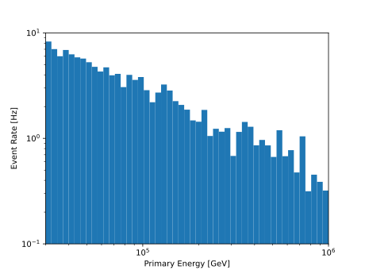

.. SPDX-FileCopyrightText: © 2022 the SimWeights contributors
..
.. SPDX-License-Identifier: BSD-2-Clause

How to Weight Without Using TableIO
===================================

Although simweights was designed to be used with hdf5 files created byt tableio,
it is possible to skip this step. The trick is to create python objects with the
same structure as the file objects that simweights expects.

The following is an example of how to do that

.. literalinclude :: ../examples/without_tableio.py

